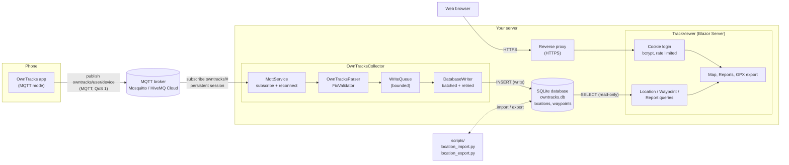

# OwnTracks Location Collector

A self-hosted .NET 10 toolkit for collecting, viewing and moving [OwnTracks](https://owntracks.org/) location history. Your data stays in a single SQLite file that you own.

| Component | Description |
|---|---|
| **[OwnTracksCollector](OwnTracksCollector/)** | Console app / Windows Service — subscribes to an MQTT broker and persists location and waypoint messages to SQLite |
| **[TrackViewer](TrackViewer/)** | Blazor Server web app — dark-themed interactive map for browsing, filtering, reporting on and exporting tracks |
| **[scripts](scripts/)** | Python command-line tools to import (Google Timeline, Foursquare, GPX) and export (GPX, CSV) location history |
| **[OwnTracksCollector.Tests](OwnTracksCollector.Tests/)** | xUnit tests for the collector |

The collector and the viewer share the same SQLite database file.

> **Privacy:** this project handles precise location history. Never commit your `.db` file, broker credentials or password hash, and put TrackViewer behind HTTPS if you expose it to the internet (see [Security notes](#security-notes)).

---

## Features

### OwnTracksCollector
- Connects to any MQTT broker (HiveMQ Cloud, Mosquitto, …) over plain TCP or TLS
- Subscribes to configurable topics (default `owntracks/#`)
- Parses location fixes and waypoints (single `waypoint` and bulk `waypoints` exports)
- **Reliable delivery:** persistent MQTT session and QoS 1 by default, so messages published while the collector is down are delivered on reconnect
- **Batched writes:** messages go through a bounded in-memory queue and are written in transactions; if the database is locked they are kept and retried with back-off, and a full queue slows the receiver instead of dropping data
- **Duplicate-safe:** unique indexes make redelivered or re-sent messages harmless
- **Input validation:** rejects non-finite or out-of-range coordinates, exactly `0,0` (no fix), and implausible timestamps (before 2000 or far in the future)
- Automatic reconnection with exponential back-off; keeps retrying if the broker is down at start-up
- Strongly typed, validated settings — a bad value stops start-up with a message naming the setting
- Runs as a Windows Service; logs to the console, or to the Windows Event Log as a service
- Configuration via `appsettings.json` or `OWNTRACKS_` environment variables

### TrackViewer
- Interactive Leaflet map (CartoDB Dark Matter tiles by default; any tile server can be configured)
- Per-device filtering, date range pickers, quick ranges (Today, Yesterday, 7/30 days) and a time-zone selector
- Layer toggles: tracks, individual points, waypoints, heatmap
- Automatic trip segmentation at a configurable time gap
- Live auto-refresh with pause/resume
- Stats bar: points, devices, distance and date range
- **Reports** page: days with track data per device, in a chosen time zone
- GPX 1.1 export with waypoints and per-device trip segments
- Cookie authentication with bcrypt password hashing; rate-limited login (5 attempts per minute)

### Import / export scripts
- Import Google Timeline JSON, Foursquare/Swarm check-ins and GPX files; export a date range to GPX or CSV
- `--dry-run` mode, duplicate detection, thinning, standard-library Python only — see [scripts/Scripts.md](scripts/Scripts.md)

---

## Architecture



1. The OwnTracks app publishes each location fix and waypoint to the broker on the topic `owntracks/<user>/<device>`.
2. The collector subscribes to `owntracks/#` with a persistent session, so messages published while it is offline are delivered when it reconnects.
3. Each message is parsed and validated, queued, and written to SQLite in batches. Duplicate rows are ignored.
4. TrackViewer reads the same database file and serves the map, reports and GPX export to your browser after login.
5. The Python scripts work directly on the database file to import history from other sources or export it.

---

## Quick start

```powershell
git clone https://github.com/<your-account>/OwnTracksCollector.git
cd OwnTracksCollector

# 1. Point the collector at your broker (see Configuration) and run it
dotnet run --project OwnTracksCollector --configuration Release

# 2. Create a password hash for the web app and put it in TrackViewer/appsettings.json
dotnet run --project TrackViewer -- --hash-password "YourPassword"

# 3. Run the viewer against the same database file
dotnet run --project TrackViewer --urls http://localhost:5000
```

Then configure the OwnTracks app on your phone ([OwnTracks App Setup](#owntracks-app-setup)).

---

## Project structure

```
OwnTracksCollector.sln
├── OwnTracksCollector/
│   ├── Program.cs               # Host setup, settings validation
│   ├── Worker.cs                # BackgroundService managing the MQTT lifecycle
│   ├── appsettings.json
│   ├── Models/                  # LocationMessage, WaypointMessage
│   ├── Settings/                # MqttOptions, DatabaseOptions + validators
│   └── Services/
│       ├── MqttService.cs       # Connect, subscribe, reconnect
│       ├── OwnTracksParser.cs   # JSON payload -> messages
│       ├── FixValidator.cs      # Coordinate / timestamp sanity checks
│       ├── WriteQueue.cs        # Bounded queue between MQTT and the database
│       ├── DatabaseWriter.cs    # Batched, retrying writer
│       ├── IDatabaseService.cs
│       └── DatabaseService.cs   # Schema, unique indexes, INSERTs
├── OwnTracksCollector.Tests/    # xUnit tests
├── TrackViewer/
│   ├── Program.cs               # Auth, rate limiter, login/logout, GPX endpoint
│   ├── Pages/                   # MapView, Reports, Export, Login, host page
│   ├── Shared/                  # Layout, auth redirect
│   ├── Models/                  # LocationRecord, WaypointRecord, TrackFilter, DaySummary, …
│   ├── Services/                # DbInitialiser, Location/Waypoint/Report queries, GpxExportService
│   └── wwwroot/                 # CSS and Leaflet interop (mapInterop.js)
└── scripts/                     # location_import.py, location_export.py, formats/
```

---

## Prerequisites

- [.NET 10 SDK](https://dotnet.microsoft.com/download/dotnet/10.0)
- An MQTT broker for the collector, for example:
  - **HiveMQ Cloud** — free tier at [hivemq.com](https://www.hivemq.com/mqtt-cloud-broker/)
  - **Mosquitto** — `winget install mosquitto` or [mosquitto.org](https://mosquitto.org/)
- The [OwnTracks](https://owntracks.org/) app on your Android or iOS device, in MQTT mode
- Python 3.8+ (only for the import/export scripts)

The Windows Service and Event Log features are Windows-only. The collector and viewer otherwise run anywhere .NET 10 does.

---

## Configuration

### Collector

Edit `OwnTracksCollector/appsettings.json`:

```json
{
  "Mqtt": {
    "Host":     "localhost",
    "Port":     "1883",
    "UseTls":   "false",
    "Username": "",
    "Password": "",
    "Topic":    "owntracks/#",
    "ClientId": "owntracks-collector",
    "CleanSession": false,
    "QualityOfService": 1
  },
  "Database": {
    "Path": "owntracks.db",
    "RemoveDuplicates": false,
    "BatchSize": 500,
    "QueueCapacity": 100000
  }
}
```

| Setting | Default | Meaning |
|---|---|---|
| `Mqtt:ClientId` | `owntracks-collector` | Must be stable and unique on the broker: with a persistent session the broker uses it to find your queued messages. |
| `Mqtt:CleanSession` | `false` | `false` = the broker keeps the session and holds messages published while the collector is down, delivering them on reconnect. |
| `Mqtt:QualityOfService` | `1` | Subscription QoS (0, 1 or 2). 1 can redeliver a message, which the database ignores as a duplicate. |
| `Database:RemoveDuplicates` | `false` | Set to `true` **once** if the log warns that existing duplicate rows prevent the unique index; the oldest row of each group is kept. |
| `Database:BatchSize` | `500` | Maximum rows per database transaction. |
| `Database:QueueCapacity` | `100000` | Messages held in memory waiting to be written; when full the receiver slows down instead of dropping data. |

#### Broker profiles

Local Mosquitto (default):
```json
"Host": "localhost",  "Port": "1883",  "UseTls": "false"
```

HiveMQ Cloud:
```json
"Host": "your-cluster.s1.eu.hivemq.cloud",  "Port": "8883",  "UseTls": "true",
"Username": "your-username",  "Password": "your-password"
```

#### Environment variable overrides

Any collector setting can be overridden with environment variables prefixed `OWNTRACKS_`, using double underscores as section separators:

```powershell
$env:OWNTRACKS_Mqtt__Host     = "your-cluster.hivemq.cloud"
$env:OWNTRACKS_Mqtt__Password = "secret"
$env:OWNTRACKS_Mqtt__UseTls   = "true"
```

This is the recommended way to keep credentials out of `appsettings.json`.

### TrackViewer

Edit `TrackViewer/appsettings.json`:

```json
{
  "Database": { "Path": "C:\\Data\\owntracks.db" },
  "Map": {
    "TileUrl": "https://{s}.basemaps.cartocdn.com/dark_all/{z}/{x}/{y}{r}.png",
    "TileAttribution": "© OpenStreetMap contributors © CARTO",
    "DefaultZoom": 13,
    "AutoRefreshSeconds": 20
  },
  "Query": {
    "MaxLocationRows": 50000,
    "TripSegmentThresholdMinutes": 30
  },
  "Auth": {
    "Username": "admin",
    "PasswordHash": "<bcrypt hash — see below>",
    "CookieExpiryMinutes": 480
  }
}
```

| Setting | Meaning |
|---|---|
| `Database:Path` | The SQLite file written by the collector |
| `Map:TileUrl` / `TileAttribution` | Tile server and its required attribution. Check your provider's usage policy — the public OpenStreetMap tile servers are not intended for heavy use |
| `Map:AutoRefreshSeconds` | Live-refresh interval |
| `Map:MaxPointMarkers` | Most individual points drawn at once (default 20000). Above this the Points layer is hidden with a warning; use "Visible area only" or a shorter range |
| `Query:MaxLocationRows` | Cap on rows loaded per query |
| `Query:TripSegmentThresholdMinutes` | A gap longer than this splits a track into separate trips |
| `Auth:*` | Login user name, bcrypt password hash and session cookie lifetime (minutes) |

Generate the hash with:

```powershell
dotnet run --project TrackViewer -- --hash-password "YourPassword"
```

Prefer environment variables for secrets here too: `Auth__PasswordHash`, `Database__Path`, and so on (ASP.NET Core's standard `__` convention).

---

## Running

### Collector as a console application

```powershell
cd OwnTracksCollector
dotnet run --configuration Release
```

Press **Ctrl+C** for a graceful disconnect and shutdown.

### Collector as a Windows Service

**1. Publish a self-contained executable:**

```powershell
dotnet publish OwnTracksCollector -c Release -r win-x64 --self-contained true -o C:\Services\OwnTracksCollector
```

**2. Register and start the service** (PowerShell as Administrator):

```powershell
sc.exe create OwnTracksCollector `
    binPath= "C:\Services\OwnTracksCollector\OwnTracksCollector.exe" `
    DisplayName= "OwnTracks Location Collector" `
    start= auto

sc.exe start OwnTracksCollector
```

**3. View logs:**

```powershell
Get-EventLog -LogName Application -Source OwnTracksCollector -Newest 50
```

**4. Stop and remove:**

```powershell
sc.exe stop OwnTracksCollector
sc.exe delete OwnTracksCollector
```

> **Tip:** as a service, set credentials as Machine-scoped environment variables instead of storing them in `appsettings.json`:
> ```powershell
> [System.Environment]::SetEnvironmentVariable("OWNTRACKS_Mqtt__Password", "secret", "Machine")
> ```

### TrackViewer

```powershell
dotnet run --project TrackViewer --urls http://localhost:5000
```

Open **http://localhost:5000** and sign in. Pages: `/` (map), `/reports` (days with data), `/export` (GPX export).

For anything beyond local use, publish it (`dotnet publish TrackViewer -c Release`) and run it behind a reverse proxy that terminates HTTPS. The app honours `X-Forwarded-For` and `X-Forwarded-Proto`.

---

## Import and export

The [scripts](scripts/) folder holds standalone Python tools for bringing existing history into the database and getting it back out:

```powershell
# Preview, then import, a Google Timeline export
python scripts/location_import.py Timeline.json owntracks.db --user alice --device phone --dry-run
python scripts/location_import.py Timeline.json owntracks.db --user alice --device phone

# Export a date range to GPX or CSV
python scripts/location_export.py owntracks.db trip.gpx --since 2026-04-01 --until 2026-04-30
```

**Back up your database before the first real import.** Full options and format notes are in [scripts/Scripts.md](scripts/Scripts.md).

---

## Tests

```powershell
dotnet test
```

The tests cover the payload parser, coordinate validation, the database writer and schema/index handling, and settings validation.

---

## Security notes

- **Set your own login.** Generate your own `Auth:PasswordHash` before running TrackViewer and do not reuse a password that protects anything else. Never publish a hash of a real password.
- **Use HTTPS** when TrackViewer is reachable from outside your network. Login cookies and your location history otherwise travel in clear text.
- **Keep secrets out of git.** Use environment variables for the MQTT password and password hash. Database files (`*.db`) are git-ignored; keep it that way.
- Login is rate limited to 5 attempts per minute, but there is a single configured account and no multi-user support.
- `AllowedHosts` is `*` by default; restrict it when you serve the app on a known host name.

---

## Database schema

The SQLite database (default `owntracks.db`) contains two tables, created automatically by the collector on start-up.

### `locations`

One row per OwnTracks `_type: location` message. Unique on (`user`, `device`, `timestamp`).

| Column | Type | Description |
|---|---|---|
| `id` | INTEGER | Auto-incremented primary key |
| `user` | TEXT | OwnTracks username (from MQTT topic) |
| `device` | TEXT | OwnTracks device name (from MQTT topic) |
| `latitude` | REAL | Latitude in decimal degrees (WGS 84) |
| `longitude` | REAL | Longitude in decimal degrees (WGS 84) |
| `timestamp` | INTEGER | UNIX epoch timestamp (seconds) |
| `accuracy` | REAL | Horizontal accuracy in metres |
| `altitude` | REAL | Altitude above mean sea level in metres |
| `velocity` | INTEGER | Speed in km/h |
| `battery` | INTEGER | Device battery level (0–100) |
| `tracker_id` | TEXT | Two-character tracker label (`tid`) |
| `trigger` | TEXT | Report trigger: `p` ping, `c` region, `u` manual, `t` timer, etc. |
| `connection` | TEXT | Connection type: `w` WiFi, `m` mobile, `o` offline |
| `raw_payload` | TEXT | Original JSON payload for auditing or reprocessing |
| `created_at` | TEXT | UTC timestamp of when the row was inserted |

### `waypoints`

One row per waypoint from `_type: waypoint` or from the `waypoints` array of a bulk export. Unique on (`user`, `device`, `timestamp`, `latitude`, `longitude`), so re-sent waypoints are not duplicated.

| Column | Type | Description |
|---|---|---|
| `id` | INTEGER | Auto-incremented primary key |
| `user` | TEXT | OwnTracks username (from MQTT topic) |
| `device` | TEXT | OwnTracks device name (from MQTT topic) |
| `description` | TEXT | Waypoint name / label (`desc`) |
| `latitude` | REAL | Latitude in decimal degrees (WGS 84) |
| `longitude` | REAL | Longitude in decimal degrees (WGS 84) |
| `radius` | INTEGER | Geofence radius in metres (`rad`) |
| `timestamp` | INTEGER | UNIX epoch timestamp when the waypoint was created/updated |
| `raw_payload` | TEXT | Original JSON payload |
| `created_at` | TEXT | UTC timestamp of when the row was inserted |

Query it with any SQLite tool, such as [DB Browser for SQLite](https://sqlitebrowser.org/).

**Recent location fixes per device:**
```sql
SELECT user, device, latitude, longitude,
       datetime(timestamp, 'unixepoch') AS time,
       battery
FROM   locations
ORDER  BY timestamp DESC
LIMIT  20;
```

**All waypoints for a user:**
```sql
SELECT user, device, description, latitude, longitude, radius,
       datetime(timestamp, 'unixepoch') AS created
FROM   waypoints
WHERE  user = 'alice'
ORDER  BY timestamp;
```

---

## OwnTracks App Setup

In the OwnTracks app, go to **Preferences → Connection** and configure:

| Setting | Value |
|---|---|
| Mode | MQTT |
| Host | IP or hostname of your broker |
| Port | `1883` (plain) or `8883` (TLS) |
| TLS | Match `UseTls` in the collector config |
| Username / Password | Match broker credentials |
| Topic base | `owntracks` (the app appends `/{user}/{device}` automatically) |

---

## Dependencies

### OwnTracksCollector

| Package | Version | Purpose |
|---|---|---|
| `MQTTnet` | 5.2.0.1603 | MQTT client |
| `Microsoft.Data.Sqlite` | 10.0.12 | SQLite access |
| `Microsoft.Extensions.Hosting` | 10.0.12 | Generic Host / BackgroundService |
| `Microsoft.Extensions.Hosting.WindowsServices` | 10.0.12 | Windows Service integration |
| `Microsoft.Extensions.Configuration.*` | 10.0.12 | JSON + environment variable configuration |

### TrackViewer

| Package | Version | Purpose |
|---|---|---|
| `Microsoft.Data.Sqlite` | 10.0.12 | SQLite read access |
| `BCrypt.Net-Next` | 4.2.1 | Password hashing |

Client-side libraries loaded from a CDN:

| Library | Version | Purpose |
|---|---|---|
| Bootstrap | 5.3.3 | UI framework |
| Bootstrap Icons | 1.11.3 | Icon font |
| Leaflet.js | 1.9.4 | Interactive map |
| Leaflet.heat | 0.2.0 | Heatmap layer |
| Flatpickr | latest | Date picker |

---

## License

MIT License

Copyright (c) 2026 José Oliver-Didier

Permission is hereby granted, free of charge, to any person obtaining a copy
of this software and associated documentation files (the "Software"), to deal
in the Software without restriction, including without limitation the rights
to use, copy, modify, merge, publish, distribute, sublicense, and/or sell
copies of the Software, and to permit persons to whom the Software is
furnished to do so, subject to the following conditions:

The above copyright notice and this permission notice shall be included in all
copies or substantial portions of the Software.

THE SOFTWARE IS PROVIDED "AS IS", WITHOUT WARRANTY OF ANY KIND, EXPRESS OR
IMPLIED, INCLUDING BUT NOT LIMITED TO THE WARRANTIES OF MERCHANTABILITY,
FITNESS FOR A PARTICULAR PURPOSE AND NONINFRINGEMENT. IN NO EVENT SHALL THE
AUTHORS OR COPYRIGHT HOLDERS BE LIABLE FOR ANY CLAIM, DAMAGES OR OTHER
LIABILITY, WHETHER IN AN ACTION OF CONTRACT, TORT OR OTHERWISE, ARISING FROM,
OUT OF OR IN CONNECTION WITH THE SOFTWARE OR THE USE OR OTHER DEALINGS IN THE
SOFTWARE.
